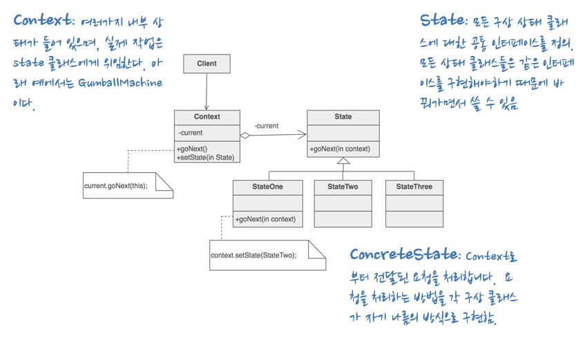

# 10. 스테이트 패턴

# 👀 학습 목표

- 스테이트 패턴을 이해한다.
    - **스트래티지 패턴**: 바꿔 쓸 수 있는 행동을 캡슐화한 다음, 실제 행동은 다른 객체에 위임합니다.
    - **스테이트 패턴:** 상태를 기반으로 하는 행동을 캡슐화하고 행동을 현재 상태한테 위임합니다.
- 스테이트 패턴 예제를 이해한다.

# 1. 스테이트 패턴 정의

## 1-1. 스테이트  패턴이란

> 객체의 내부 상태가 바뀜에 따라서 객체의 행동을 바꿀 수 있다. 마치 객체의 클래스가 바뀌는 것과 같은 결과를 얻을 수 있다.

sourcemaking 이미지 참고 